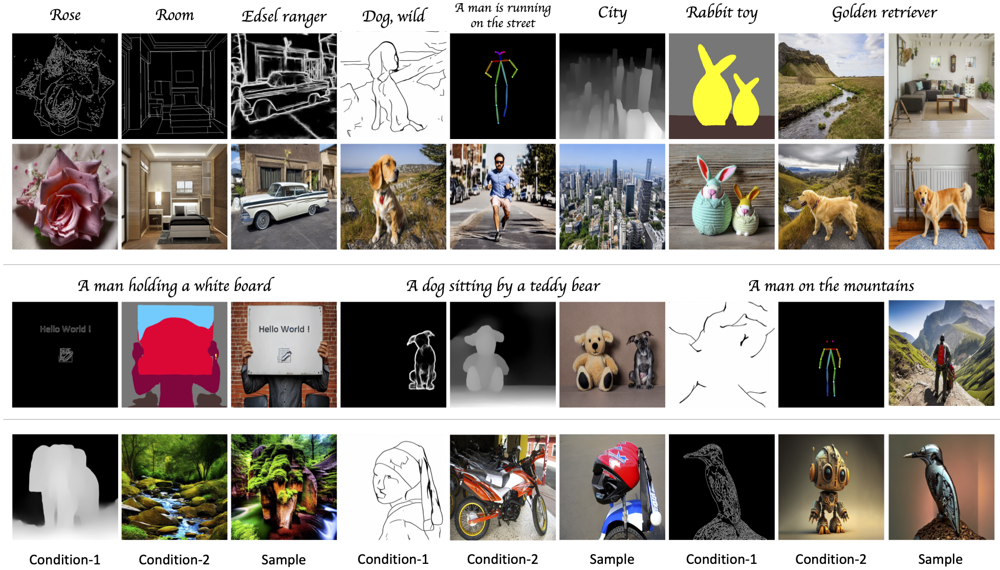

# Controllable Video Decoding with Uni-ControlNet

This work is based on:

Official implementation of Uni-ControlNet: All-in-One Control to Text-to-Image Diffusion Models, which is accepted by NeurIPS 2023.

### [Project Page](https://shihaozhaozsh.github.io/unicontrolnet/) | [Paper (ArXiv)](https://arxiv.org/abs/2305.16322) 

## Acknowledgment :
This work was supported by Institute of Information & communications Technology Planning & Evaluation (IITP) grant funded by the Korea government(MSIT) (No.RS-2022-00155911, Artificial Intelligence Convergence Innovation Human Resources Development (Kyung Hee University))
